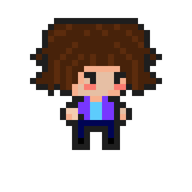
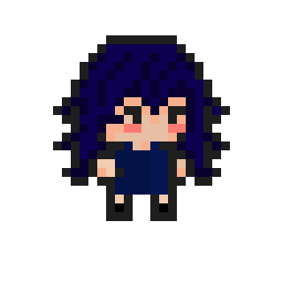
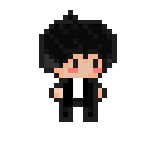
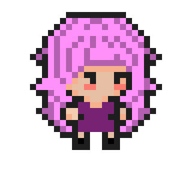
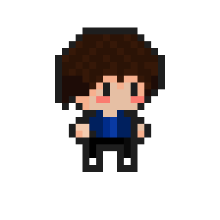
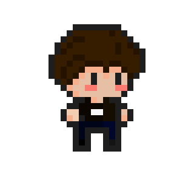
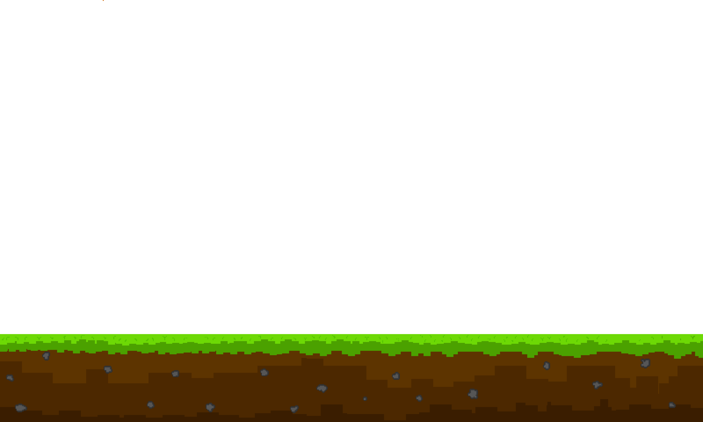
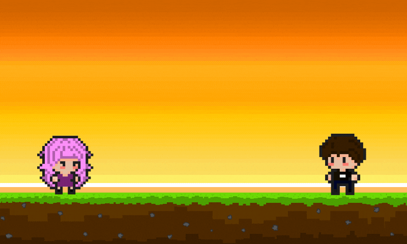

# Diseño de interfaz de ususario

La interfaz de usuario de la aplicacion Lost Beyond esta inspirada en la interfaz de multiples juegos como paper mario, undertale y gris, asi mismo nuestra interfaz se maneja en el concepto del [Pixelart](https://thecolor.blog/es/que-es-el-pixel-art-todo-lo-que-necesitas-saber/#:~:text=El%20pixel%20art%20es%20un%20arte%202D%20que,de%20colores%20restringidas%20en%20una%20cuadr%C3%ADcula%20de%20p%C3%ADxeles.)

1. Diseño de Personajes y su nombre:

	### Camilo:
	

	### Dani:
	

	### Issei(protagonista secundario):
	

	### Joel:
	

	### Johan:
	

	### Luna:
	

	### Nico:
	

	### PJ (Personaje Principal):
	

2. Diseño del Suelo:
	En el momento se diseño un tipo de suelo, el cual tambien se va a usar para las diferentes plataformas que se diseñen

	### Tipo Suelo:
	

3. Tipo de prototipo con background:
	Aun no se ha podido decidir que tipo de colores usar para este primer nivel, y poder expresar lo que queremos por esto adelantamos animaciones Estaticas de los personajes dejaremos un ejemplo, con un background generico que intentamos:

	### Imagen con Background:
	