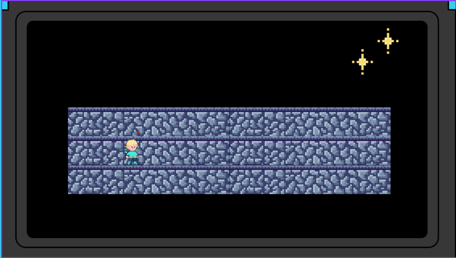
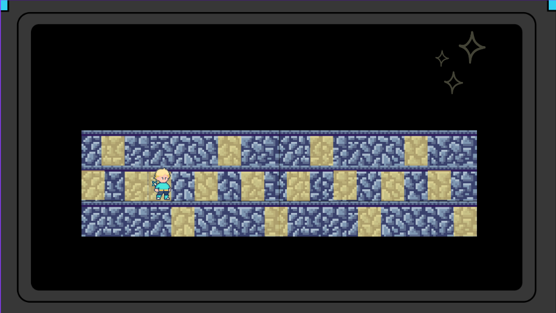
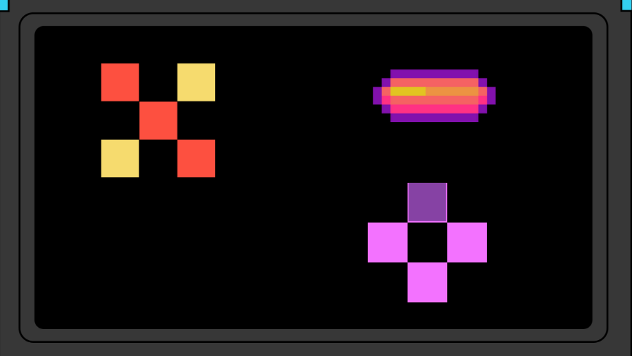
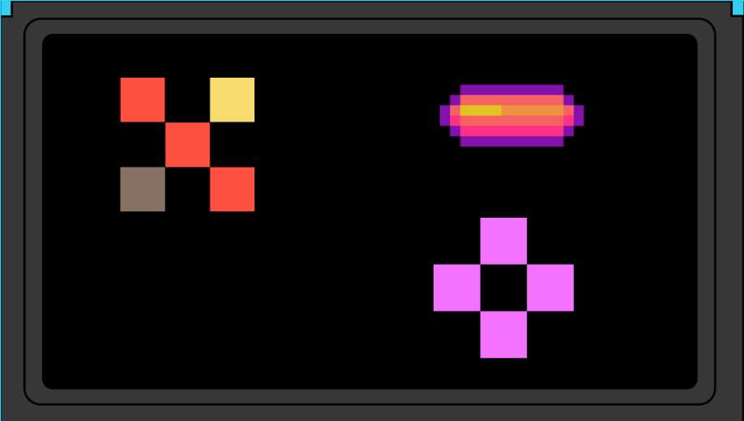
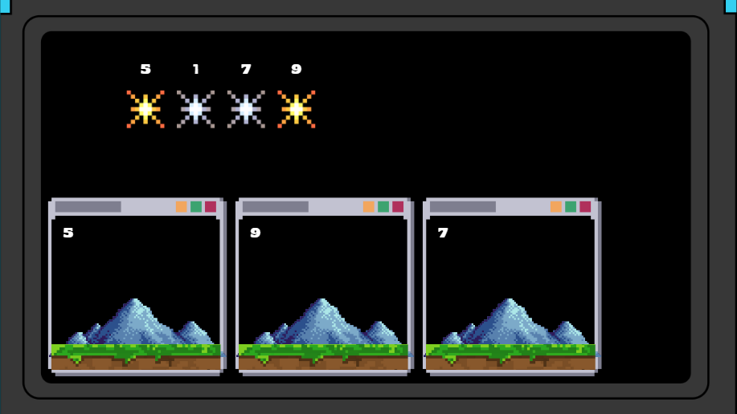
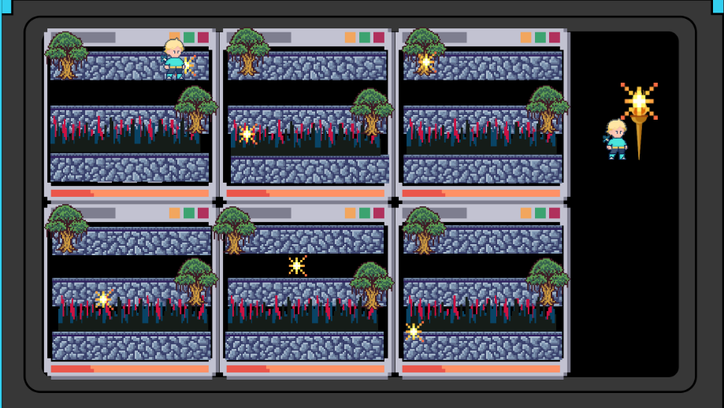

# Bocetos y explicación de los acertijos

1. Seguir un camino donde hay una luz que se enciende y se apaga, cuando se enciende puede avanzar, cuando se apaga puede ver las baldosas correctas por las que debe avanzar, si avanza mal se devuelve al inicio
   # Puede simbolizar la pérdida de sentido (Luz apagada) junto con la esperanza de encontrar el camino dentro de la oscuridad (Baldosas encendidas)
   :

   ### Acertijo 1 luces apagadas:
   
   ### Acertijo 1 luces encendidas:
   
2. # Repetir patrones
   Se iluminaran unas baldosas de manera secuencial y el jugador tendra que repetir la secuencia hasta completar la barra 
   ### Acertijo 2 parte 1:
   
   ### Acertijo 2 parte 2:
   
3. # Encender switches según números hallados en el camino. 
   Los números pueden aparecer durante el trayecto y le darán el orden al protagonista para resolver el acertijo de antorchas/luces apagadas. La forma de encenderlas será pasando por encima de ellas y si se equivoca en el orden tendrá que repetirlo
   ### Acertijo 3:
   
4. Seguir una luz que vaya de un lugar a otro
   ### Acertijo 4:
   
5. -juntar piezas para armar una figura
   -Una carrera contra tiempo que puede ser tipo mariobros o un cambio de plano
   -recolectar una cantidad de algo (Monedas, recuerdos) en cierto tiempo
